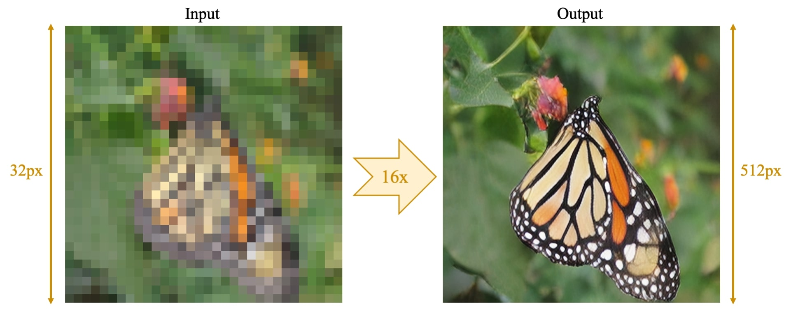

# HyperRIM: Hyper-Resolution Implicit Model

[Project Page][project] | [Paper][paper] | [Pre-trained Models][pretrain]

PyTorch implementation of HyperRIM: a conditional deep generative model that avoids mode collapse and can generate multiple outputs for the same input.
The model is trained with [Implicit Maximum Likelihood Estimation (IMLE)](https://arxiv.org/abs/1809.09087).
HyperRIM is able to:

- Increase the width and height of images by a factor of 16x
- Recover a plausible image from a badly compressed image
- Possibly do other things yet to be explored 😃

## Installation
Please refer to [this page](https://github.com/niopeng/HyperRIM/tree/main/code#hyperrim-hyper-resolution-implicit-model).

## Organization
The repository consists of the following components:
- `code/`: Code for training and testing the model
- `experiments/`: Directory for checkpoints and plots
- `website/`: Resources for the project page
- `index.html`: Project page

[project]:https://niopeng.github.io/HyperRIM/
[paper]: https://arxiv.org/abs/2011.01926
[pretrain]: https://github.com/niopeng/HyperRIM/tree/main/experiments/pretrained_models
